# End-to-End Training of a Classification Model with Synthetic Data
Training a classification model to identify new ship types in marine oblique scenes.

<b>Recreate this example yourself with a free trial to the Rendered.ai Platform, using content code: *MARINECLASS* to access a workspace pre-loaded with a test dataset, synthetic data generation workflows, and a classification model. Visit [www.rendered.ai](https://www.rendered.ai/free-trial) to get started.</b>

## Objectives 
To demonstrate how the Rendered.ai Platform as a Service can be used to generate customized synthetic imagery data to train and test computer vision systems with:  
- Improved model performance 
- Significantly reduced development time 
- A more diverse set of training scenarios 
- Smaller amounts of real data 

## Test Dataset 
The open source [Roboflow Ships](https://www.kaggle.com/datasets/vinayakshanawad/ships-dataset) image classification dataset from [Kaggle](https://www.kaggle.com). This real dataset is broken down into 10 classes:

|  |
| :--: |
| *Population of Each Ship Class in Complete Real Dataset* |

## Model 
NVIDIA TAO v5.5 with backbone pre-trained weights from the tiny Fully Attentional Network (FAN) model. Available in NVIDIA’s [NGC Catalog](https://catalog.ngc.nvidia.com/orgs/nvidia/teams/tao/models/pretrained_fan_classification_imagenet).

## Methodology Used
### 1. Establishing a Baseline of Target Model Performance
The amount of data used to train a model is as important as the hyperparameters used to tune performance. Learning rates and number of epochs are correlated to how many training samples are used. Intentionally restricting the amount of real data helps to establish a baseline to determine how much data is needed to train a computer vision model. It is effective to think of the baseline as a curve that represents the accuracy of classification models trained on various amounts of real data.  

#### Focusing On a Limited Number of Classes 

To accelerate the development time for this example, engineers focused on four classes: aircraft carriers, sailboats, submarines, and tugboats. They first tuned the hyperparameters to train a model on the real “Roboflow Ships Image” data to perform like the reported accuracy on the Kaggle classification dataset. Engineers found that using the default learning rate and epoch number for the TAO PyTorch Classification Model Trainer provided poor accuracy. By experimenting with and analyzing the loss curves, they realized that the learning rate was too high. Lowering the starting learning rate to 1e-4 and cutting the epochs down to 50-100 resulted in a model with acceptable accuracy. Training the FAN Tiny backbone on 99% of the real dataset resulted in better accuracy in all classifications, except for the sailboat class. 

| 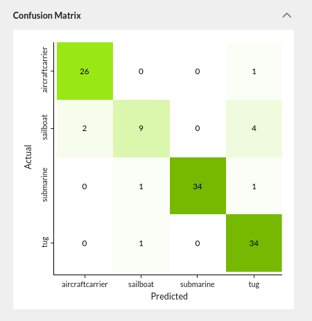 |
| :--: |
| *Real Test Confusion Matrix for the Baseline Model (Trained on Real Data)* |

From the datasets tab on Rendered.ai, the inference labels and prediction confidence scores can be seen. Here are examples of the real test dataset with inference details of the baseline model. 

| 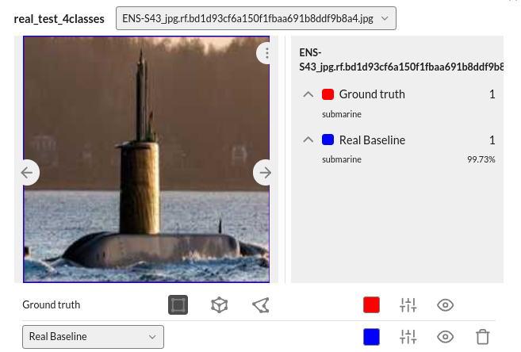| 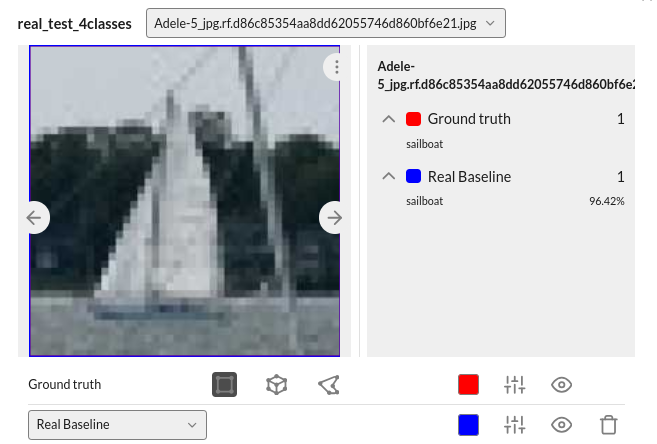 |
|  | 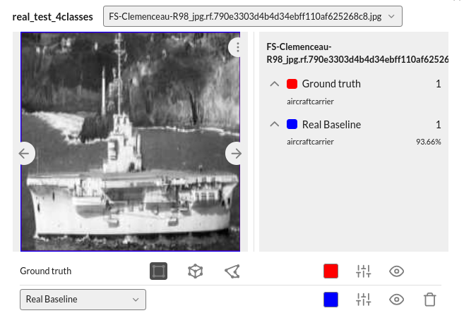 |
| :--: | :--: |
| *Baseline Inference Examples* ||

The loss is estimated at each epoch during training. For larger training sets, the models tend to converge faster. Keep an eye on the loss curve to get a sense of how many epochs are needed for your experiment. This resulted in a converged model at risk of overfitting. 

The classification models trained in this use case with a learning rate of 1x10^-4, where the number of samples varied between 2000 and 4000, we use between 50 and 2000 epochs. Using 100 epochs for this learning rate and amount of training data would be sufficient. 

| 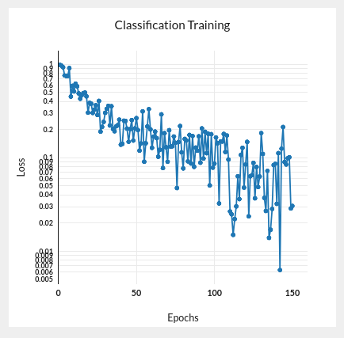 |
| :--: |
| *Validation loss curve for the complete real data training set, the “baseline” model.* |

#### Balancing the Number of Epochs 
To evaluate the amount of real data needed to achieve target model performance, engineers removed fractions of data from each class. This can cause overfitting if the real dataset is large. To model a ballpark number of epochs for a given dataset size, the engineers estimated an appropriate number of epochs for a few datasets of disparaging sizes. Specifically, they fixed the learning rate to 1x10^-4 and then found the best model accuracy for various epochs.

#### Determining Baseline Measurement
Using this model for a balanced number of epochs and fixed learning rate, engineers trained on fractions of the real data. The accuracy remained in the upper 80th percentile for all fractions above 40%. This indicated that too much 
training data was already being used. This determined a baseline measurement by which they could determine how much synthetic data would be effective. 

| 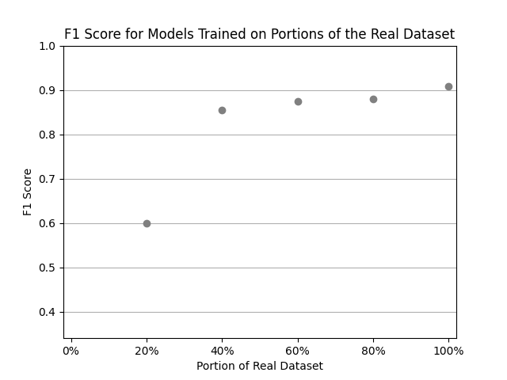  |
| :--: |
| *Classification Accuracy for Various Amounts of Real Data* |

This determined a baseline measurement by which they could determine how much synthetic data would be effective.

### 2. Generating Synthetic Data
In machine learning, “zero-shot” training refers to the absence of samples for a class, a common challenge for computer vision engineers. Various approaches can be taken to compensate for missing data, like tweaking weights and merging hypothesis classes into a generalized class. To maintain the integrity of the model to meet performance objectives, synthetic data samples were used instead. 

#### Scenario Variation
To match the scenario of the real dataset from Kaggle, ship placement, scene background (including sun placement), atmospheric conditions, camera location, and rotation were randomized using configurable workflows in the Rendered.ai platform, called “graphs”. 

|  |
| :--: |
| *A portion of the graph built in the Rendered.ai platform showcasing ship placement through 3D models organized into directories with an equal representation of each class and ships placed at a distance and rotating, mimicking the real dataset.* |

A variety of 3D assets representing samples for different classes shown in the following chart were loaded into the Rendered.ai platform and graph. 

|  |
| :--: |
| *The portion of the Rendered.ai graph showing context configuration, including HDRI backgrounds rotated randomly, an ocean scene with fixed waves, and randomized mist in the atmosphere. *|

|  |
| :--: |
| *The portion of the Rendered.ai graph showing render and sensor configurations, including Object Classification CV Task Type and randomized camera positioning. *|

Adjusting the distance from the camera within this graph enabled control of object resolution, from which the following images of aircraft carriers and tugboats were generated that looked similar to the real image samples from the Kaggle dataset. 

| 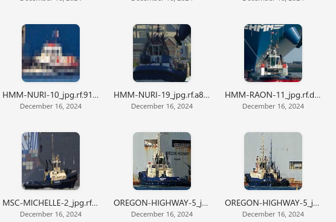 |
|  |
| :--: |
| *Tugboat Samples - Top Shows Real Data; Bottom Shows Initial Synthetic Data* |

### 3. Training and Evaluating the Zero-Shot Model 

### Initial Experiment
An experiment was designed to reproduce the curve seen in the baseline measurement using synthetic data augmenting the real data. The synthetic data training set used had 1,000 images for each class. To match the individual ship models with specific classes for CV training, Rendered.ai uses a mapping file.

|  |
| :--: |
| *Rendered.ai Mapping File For Ship Models* |

With the mapping file in place, engineers can train classification models on synthetic data. Using the initial dataset, a zero-shot F1 Score was 45.15%. Looking at the confusion matrix we see the model is biased toward aircraft carriers. 

| 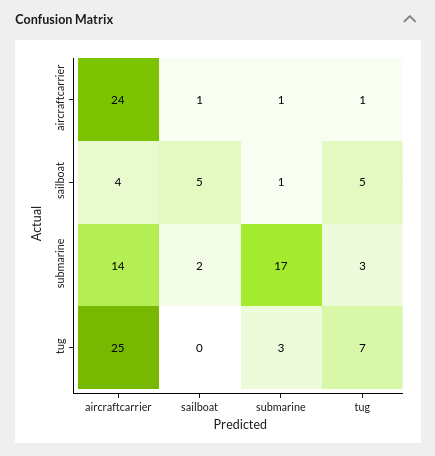 |
| :--: |
| *Real Test Confusion Matrix for a Classification Model Trained on Initial Synthetic Data* |

This told the engineers that the synthetic dataset needed to be modified to increase the representation of other object classes to improve overall model performance. 

### 4. Analyzing Performance & Updating the Model 

By comparing the failed classifications from the initial experiment to the synthetic training data, the engineers observed a few areas of opportunity to make parameter changes in the Rendered.ai graph and immediately generate a new synthetic dataset. The graph was used to adjust attributes like distance to the camera for small ships, submarine heave, sailboat rotation, and add varying surface elements (e.g., rust, warp, snow) to create more physically accurate and diverse synthetic imagery.

Additional expertise was required to increase the quality of the lowest performing classes of synthetic data: sailboats. Rendered.ai uses various generative AI tools to add diversity to their simulations. The team used Trellis, a text to 3D model generation tool, to create a batch of new models with varying masts and hull shapes. The result of these updates lead to a zero-shot classification F1 Score of 61.32%, a good starting place to perform the synthetic validation analysis.

| 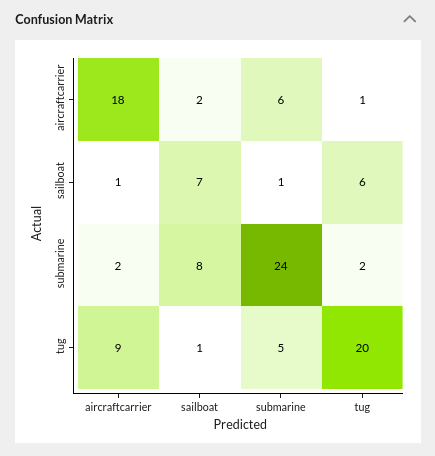 |
| :--: |
| *Real Test Confusion Matrix for a Classification Model Trained on Updated Synthetic Data* |

Looking at the confusion matrix we see the updates improved all the classes of concern.

### 5. Synthetic Validation
To ensure the synthetic data will be useful for training a ship classification model, we evaluate the performance of models trained on combinations of synthetic and real data.

#### Fine-tuning Approach
With the backbone having a good chance of detecting all classes of interest, fewer real samples should have now been needed to optimize model performance. Rendered.ai’s engineers however found that training the zero-shot model as a pre-trained backbone with the same learning rate and epoch counts on synthetic data and then the real Kaggle Ships Image Dataset did not improve model performance. Fine-tuning the model with the hyper-parameters used for the real data (a fixed learning rate with balanced number of epochs) resulted in little to no improvement of the classification accuracy over the baseline.

| 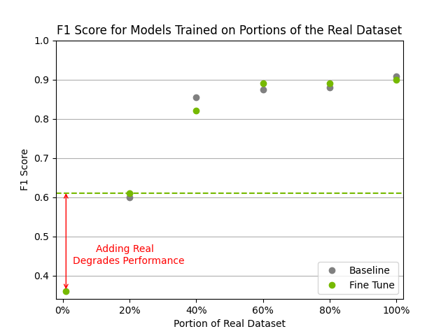 |
| :--: |
| *Classification Accuracy Versus Amount of Real Data. Fine-tuning Results Show Pretrained Weights Are Wiped Out.* |

Rendered.ai’s engineers hypothesized this occurred because it had wiped out the pretrained weights. The hyper-parameters could be adjusted for a lower learning rate to correct this, but it would require more epochs to achieve convergence and would extend training time significantly.

#### Merge Approach

Instead of training the FAN Tiny backbone on synthetic data and real data in separate cycles, engineers tested merging the datasets together to train the FAN Tiny backbone directly. Larger training datasets (between 4,500 and 7,000 samples) with fewer epochs (50 and 100 epochs) were used, resulting in a clear indication that far less real data was required to optimize model performance. 

### The Results
| 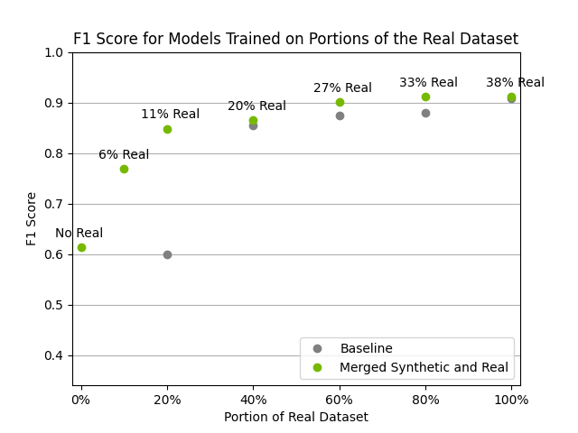 |
| :--: | 
| *Classification Accuracy Versus Amount of Real Data. X-Axis is the Portion of the Real Dataset; Text Annotations are the Percentage of the Training Set That Is Real Data.* |
<!--| *Synthetic Data Validation - Less Than Half of the Real Data is Needed to Achieve Classification Accuracy* | -->

Engineers found that only 20% of Kaggle’s real dataset was required when combined with synthetic data to achieve comparable performance as the full real dataset alone. Model performance topped out at 91% F1 Score using a merged dataset, compared to the model performance of 87% accuracy reported in the published Kaggle* notebook. 

Kaggle Challenge, https://www.kaggle.com/code/nnghiapd/cnn-with-87-accuracy

### Impact
With an open-sourced real test dataset, a standard computer vision model for this use case, and the Rendered.ai platform and team expertise, engineers demonstrated that they can effectively train a classification model to perform: 
- Much faster 
- With a lower reliance on real data
- At a higher accuracy rate for a broader set of classes

The additional expertise of the Rendered.ai team and the ability to quickly iterate on synthetic data generation workflows in the Rendered.ai platform made it possible to train, experiment with, and arrive at a performant classification model in a matter of days.

***Are you ready to experiment with synthetic data generation from this test case?*** [Start your free trial](https://rendered.ai/free-trial/) of the Rendered.ai platform and use content code: *MARINECLASS* to explore a marine oblique workspace preloaded with all of the assets used here.

***Need help validating the effectiveness of synthetic data for a different use case?*** [Request a personalized consultation](https://rendered.ai/talk-to-sales/) with the experts at Rendered.ai. 
